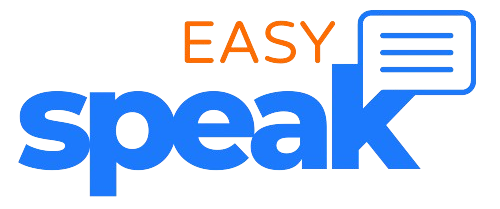
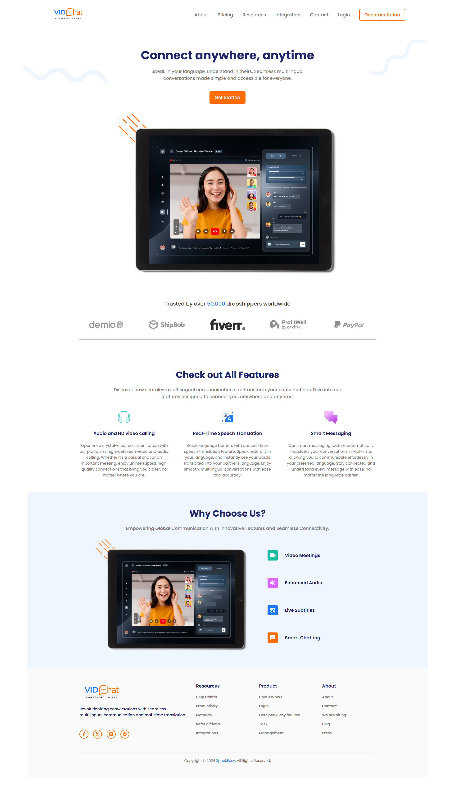
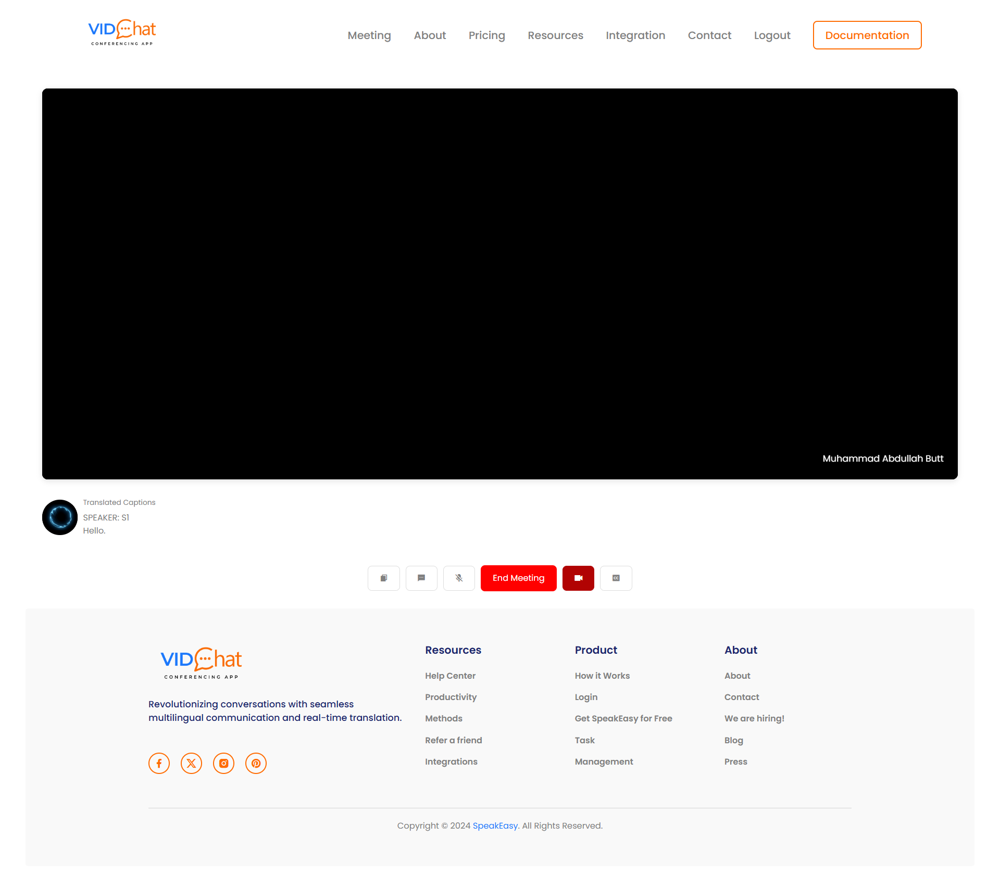

<div  align="center">
 
</div>

<h2 align="center">Redefining Global Communication with Seamless Translation and Connection</h2>

<div  align="center">


</div>

<br><br>

Speak Easy is an innovative communication platform designed to bridge language and cultural gaps in real-time. The application provides users with a seamless virtual meeting experience akin to Google Meet, with added features of live language translation and captioning. It is particularly useful for freelancers, international teams, and anyone looking to communicate effectively across language barriers.

<br><br>

## Key Features

### Video and Audio Communication

- Users can host or join virtual rooms for video and audio communication.
- Option to toggle video and audio on or off as per preference.

### Real-Time Messaging

- Integrated chat system for text-based communication during meetings.

### Live Translation

- Messages are translated into the user’s preferred language in real-time.
- Live captions are displayed in the chosen language of the user, enabling smooth communication across diverse languages.

### Secure Authentication

- Secure registration and login functionality.
- Google Sign-In integration for quick and easy access.

### Room Management

- Unique room links for hosting and joining meetings.
- Intuitive UI for room creation and management.

### Accessibility

- Designed to eliminate communication gaps for users with limited language proficiency.
- Especially beneficial for freelancers engaging with clients speaking different languages.

<br><br>

## Tech Stack

### Frontend

- **HTML5**, **CSS3**, **JavaScript**
- Responsive design with **Bootstrap** and **Tailwind CSS**

### Backend

- **Python** with **Django Framework**
- Real-time communication enabled by **Django Channels** and **WebSockets**

### Real-Time Communication

- **AgoraRTC SDK** for video and audio streaming

### Database

- SQLite (default Django database for rapid development)

### Additional Libraries

- **Google OAuth** for user authentication
- **Speech Recognition** and **Translation APIs** for language features

### Deployment

- Can be hosted on any Django-compatible server (e.g., **Heroku**, **AWS**, or **GoDaddy**).

<br><br>

## File Structure

```plaintext
.
├── db.sqlite3
├── manage.py
├── README.md
├── requirements.txt
├── speakeasy
│   ├── asgi.py
│   ├── settings.py
│   ├── urls.py
│   └── wsgi.py
├── speakhandler
│   ├── consumers.py
│   ├── models.py
│   ├── routing.py
│   ├── urls.py
│   └── views.py
├── static
│   ├── css
│   ├── images
│   ├── js
│   └── audio_files
└── templates
    ├── authentication
    ├── generic
    ├── rooms
    └── registration
```

<br><br>

## Installation

### Prerequisites

- Python 3.9 or above
- Virtual Environment (recommended)
- SQLite (or an alternative database like PostgreSQL if preferred)

### Steps

1. Clone the repository:
   
   ```bash
   git clone https://github.com/YourUsername/SpeakEasy.git
   cd SpeakEasy
   ```

2. Create a virtual environment:
   
   ```bash
   python -m venv venv
   source venv/bin/activate   # For Windows: venv\Scripts\activate
   ```

3. Install dependencies:
   
   ```bash
   pip install -r requirements.txt
   ```

4. Apply migrations:
   
   ```bash
   python manage.py migrate
   ```

5. Run the development server:
   
   ```bash
   python manage.py runserver
   ```

6. Access the application at `http://127.0.0.1:8000/`.

<br><br>

## Usage

### Hosting a Meeting

1. Log in or sign up securely.
2. Create a room using the "Create Room" feature.
3. Share the generated room link with participants.

### Joining a Meeting

1. Click on the shared room link or enter the room ID manually.
2. Set your preferred language for translations.
3. Start interacting via video, audio, or chat.

### Language Translation

- Enable real-time translation for messages and captions by selecting a language during room setup.

<br><br>

## Screenshots

### Home Page



<br><br>

### Room Interface & Live Translation



<br><br>

# 

## Acknowledgments

- **AgoraRTC SDK** for seamless video and audio integration.
- **Django Framework** for making web development easier.
- **OpenAI Translation APIs** for empowering real-time translation features.

<br><br>

**Speak Easy** is your gateway to overcoming language barriers and enabling a truly global communication experience. Let's connect the world, one meeting at a time!


